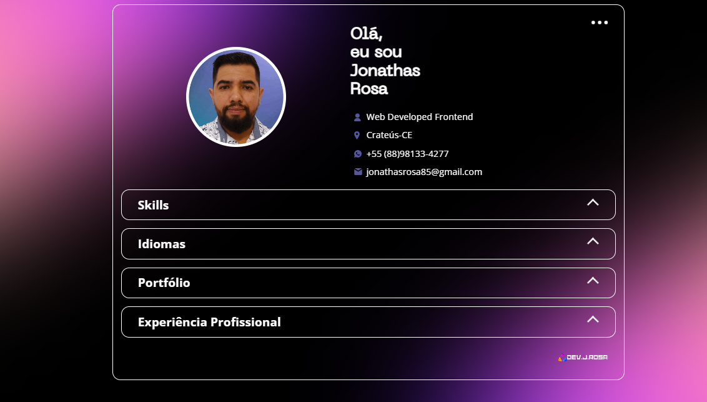

# CV-Online

Esse é um modelo de Curriculum vitae Online com minhas informações.

##

##

## 🚀 Começando

Este projeto tem intenção de divulgar meu Curriculum vitae e portifólio que está linkado no CV-online

## Ambiente de Desenvolvimento

O desenvolvimento dessa aplicação foi em 
HTML5 e CSS3 para fazer a marcação e 
estilização da base do projeto e 
JavaScript para desenvolver a lógica.

## Histórico de Atualizações

* Projeto inicial

## 🛠️ Construído com

O projeto foi construido com 

* [HTML5](https://www.w3c.br/Cursos/CursoHTML5) - Estutura do projeto.
* [CSS3](https://www.w3c.br/Cursos/CursoCSS3/) - Styles do projeto.
* [JavaScript](https://developer.mozilla.org/pt-BR/docs/Web/JavaScript) - É a linguagem usada para gerar a interação do projeto.

## 📌 Versão

Uso o [Git](https://git-scm.com/) para controle de versão. Para as versões disponíveis, observe as [tags neste repositório](https://github.com/JonathasRosa/Ecommerce-PizzAqui).

## ✒️ Autores

* **Um desenvolvedor** - *Trabalho Inicial* - [Jonathas Rosa](https://github.com/JonathasRosa)
## Redes sociais

Jonathas Rosa - [JonathasRosa](https://www.linkedin.com/in/jonathasrosa85/) - jonathasrosa85@gmail.com
##
Jonathas Rosa - [@jonathas_rosa85](https://www.instagram.com/jonathas_rosa85/) - jonathasrosa85@gmail.com

## Licença

Distribuído sobre a licença. Veja `MIT License` para mais informações.

[https://jonathasrosa.github.io/Ecommerce-PizzAqui/](https://github.com/JonathasRosa)

## 🎁 Expressões de gratidão

* Você gosstou do projeto? 
* Conte a outras pessoas sobre este projeto 📢;
* Convide alguém da equipe para uma cerveja 🍺;
* Um agradecimento publicamente a minha esposa Ingrid Mendez que me incentivou nessa jornada e a todas as outras pessoas que participaram do processo desde os que me apresentaram a programação e todos os professores;
---
⌨️ com ❤️ por [Jonathas Rosa](https://github.com/JonathasRosa) 😊